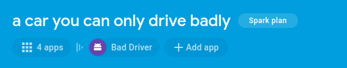
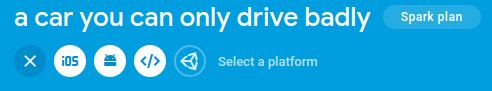
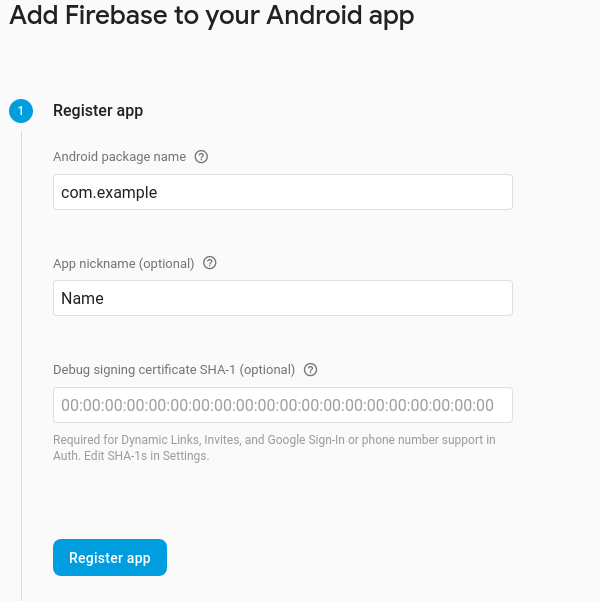
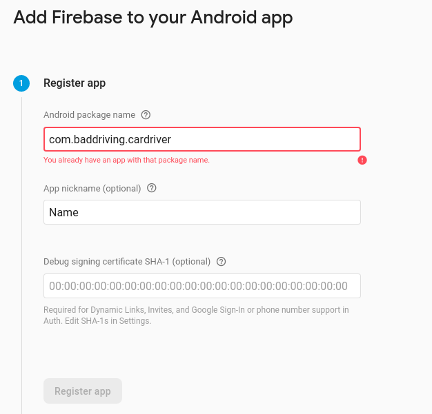
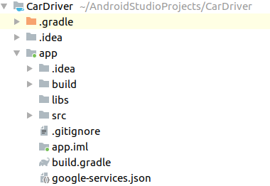

# Car Driver
 For A Car That Can Only Be Driven Badly

## Installing the App

### Install Android Studio
Directions are available at [Android Developers](https://developer.android.com/studio/install).

### Download Project
Project is available at https://github.com/401javafinal6-21-19/Car-Driver.git. To clone the project from command line, use the command

    git clone https://github.com/401javafinal6-21-19/Car-Driver.git
    
### Set up Firebase
Go to [Firebase](https://firebase.google.com/) and follow the instructions there to set up a Firebase project.

Add an Android app to your project, the buttons are at the top of the project overview page

After pressing the add app button, it will swap to a choice of types, click on the android mascot.

Enter the project's package name (it must match the project package, com.baddriving.cardriver), and a nickname for adding the project. Do not fill the third box

On the next page, download the google-services.json, and put it in the project's app foldder

### Get a device to run on
You can choose either a device, or an emulator. Note that your Android device or emulator must run at least Android Marshmallow (6.0).
#### Run on an Android device 
Follow directions at [Android Developers](https://developer.android.com/studio/debug/dev-options) to enable USB debugging. Connect the device to your computer running Android Studio.
#### Run on an Android Emulator
Follow direction at [Android Developers](https://developer.android.com/studio/run/emulator) to set up your Android Emulator.
### Run the project on your Android environment
Load the project in Android Studio, selecting the default options when you load it, and click the run button in the top bar, it looks like a green play button.

Select your device from the menu that pops up

Press ok, and the project will compile and be loaded into your Android device or emulator, and started!

## Using the App

1. From the home page:

    1. Drive the Snake
    
        1. Use the d-pad to move the snake!
        2. Navigate back home or to the Car!
        
    2. Drive the Car
    
        1. Use the d-pad to drive the car!
        2. Navigate back home or to the Snake!
        
    3. Meet the Developers
    
        1. Click to select which Dev you'd like to learn more about.
        
            | Dev | Names|
            |------|------|
            | Dana | Jess|
            |Merry | Michael|
            | Nicole | Trey|
             
        2. Navigate back home. 
    