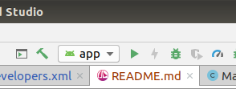
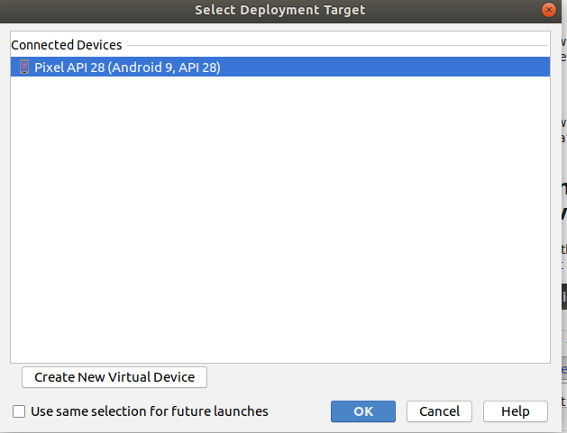

# Car Driver
 For A Car That Can Only Be Driven Badly

## Installing the App

### Download the Project

### Install Android Studio
Directions are available at [Android Developers](https://developer.android.com/studio/install).
### Get a device to run on
You can choose either a device, or an emulator. Note that your Android device or emulator must run at least Android Marshmallow (6.0).
#### Run on an Android device 
Follow directions at [Android Developers](https://developer.android.com/studio/debug/dev-options) to enable USB debugging. Connect the device to your computer running Android Studio.
#### Run on an Android Emulator
Follow direction at [Android Developers](https://developer.android.com/studio/run/emulator) to set up your Android Emulator.
### Run the project on your Android environment
Load the project in Android Studio, selecting the default options when you load it, and click the run button in the top bar, it looks like a green play button.

Select your device from the menu that pops up

Press ok, and the project will compile and be loaded into your Android device or emulator, and started!

## Using the App

1. From the home page:

    1. Drive the Snake
    
        1. Use the d-pad to move the snake!
        2. Navigate back home or to the Car!
        
    2. Drive the Car
    
        1. Use the d-pad to drive the car!
        2. Navigate back home or to the Snake!
        
    3. Meet the Developers
    
        1. Click to select which Dev you'd like to learn more about.
        
            | Dev | Names|
            |------|------|
            | Dana | Jess|
            |Merry | Michael|
            | Nicole | Trey|
             
        2. Navigate back home. 
    